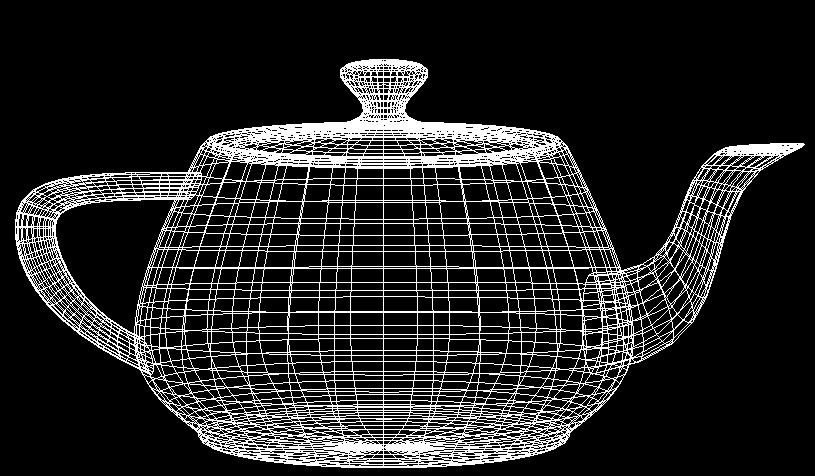
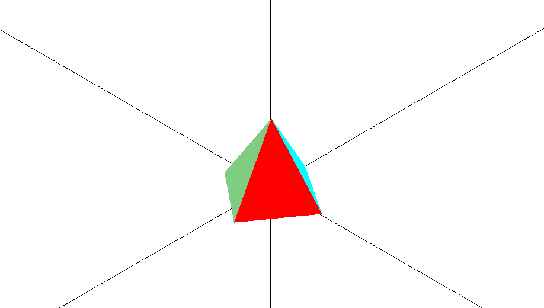
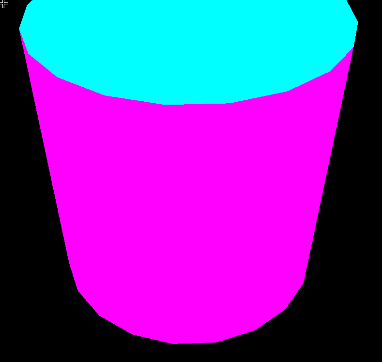
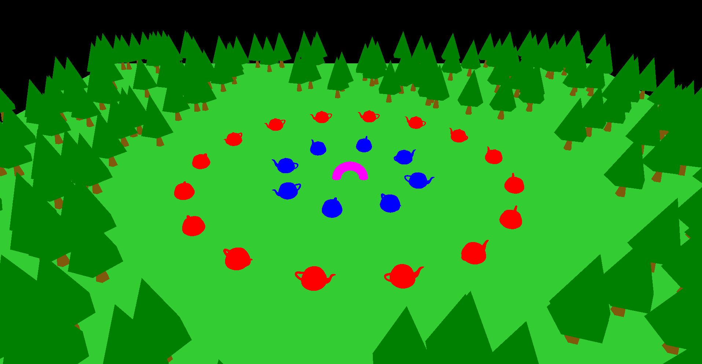
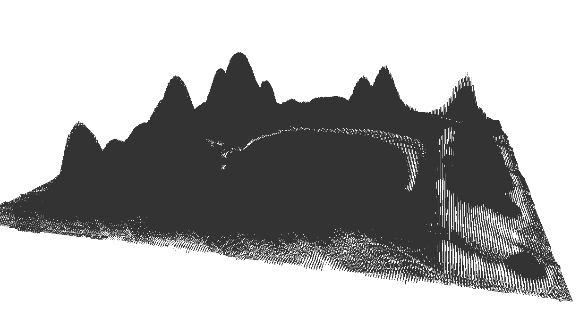
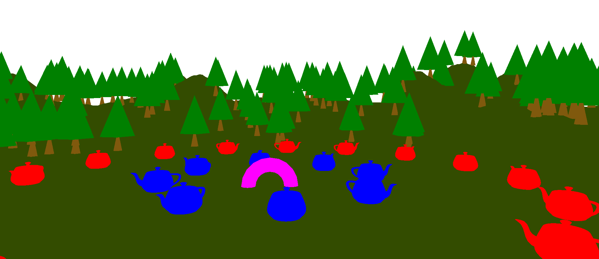
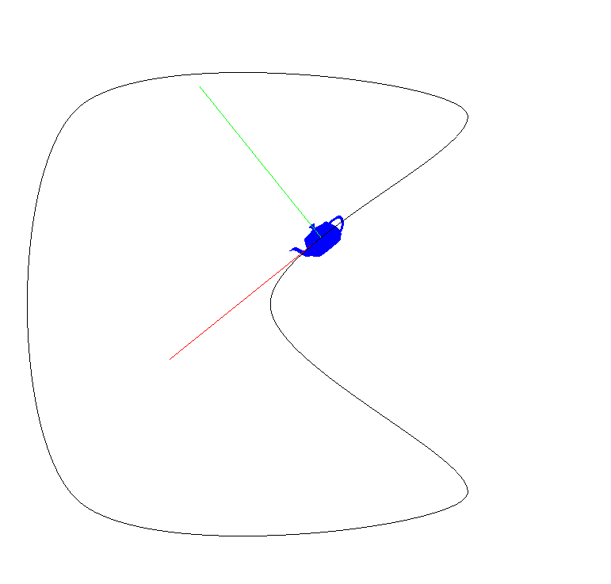
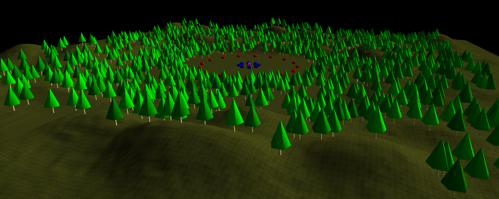

* Read this in other languages: [English](README.md), [Portuguese](README.pt.md)

	<h1><strong>Computer Graphics</strong></h1>

* Graphic Computation basics.

## Class 1 - OpenGL and GLUT

	Summary:
		* Libraries
		* Event oriented programming
		* Programming with GLUT
		* Base code skeleton
		* Geometrical primitives available in GLUT

	Exercise:
		First OpenGL program.
		

	

## Class 2 - Basic Interactivity with GLUT Graphical Primitives

	Summary:
		* Basic GLUT Interactivity	
		* Keyboard – Callback Registry
		* Mouse – Callback Registry
		* Resource Management
		* Culling and 3D Modelling

	Exercise:
		Create an interactive application with a pyramid.
		

## Class 3 - Camera Motion Drawing a Cylinder

	Summary:
		* Polar Coordinates and Spherical Coordinates
		* Explorer Mode Camera and FPS Camera

	Exercise:
		Build a cylinder using triangles defining the vertices based on polar coordinates and implment explorer mode
		

## Class 4 - Performance

	Summary:
		* VBOs
		* Frames per Second

	Exercise:
		Define vertex buffers for the cylinder (without indices)
		

## Class 5 - Geometric Transformations - Building a 3D World

	Summary:
		* World Creation

	Exercise:
		Create a terrain with trees in openGL

## Class 6 - Generating Geometry - Terrains

	Summary:
		* Height Maps
		* DevIL
		Construção de terrenos a partir de mapas de alturas

	Exercise:
		Given an image, interpret it as a height map, and generate the corresponding terrain.

## Class 7 - Decorating the Terrain

	Summary:
		* Height at any point in the terrain

	Exercise:
		Redo script for class 5, on top of the terrain from class 6.

## Class 8 - Animation with Catmull-Rom Curves

	Summary:
		* Cubic Curves – Catmull-Rom
	Exercise:
		Implementing a function to return the direction and draw the path.

## Class 9 - Lighting - Lights, Materials and Normals

	Summary:
		* Setup a light source
		* Define a material for the cylinder
		* OpenGL – Normals and VBOs
	Exercise:
		Draw a cylinder lit by a directional light

## Class 10 - Terrain II - Adding light and texture to the terrain

	Summary:
		* Terrain Normals
		* Texture Coordinates
		* Loading a Texture
		* Mipmapping
	Exercise:
		Applying texture and mipmapping to the terrain

## Aula 11 - 

	Summary:

	Exercise:

